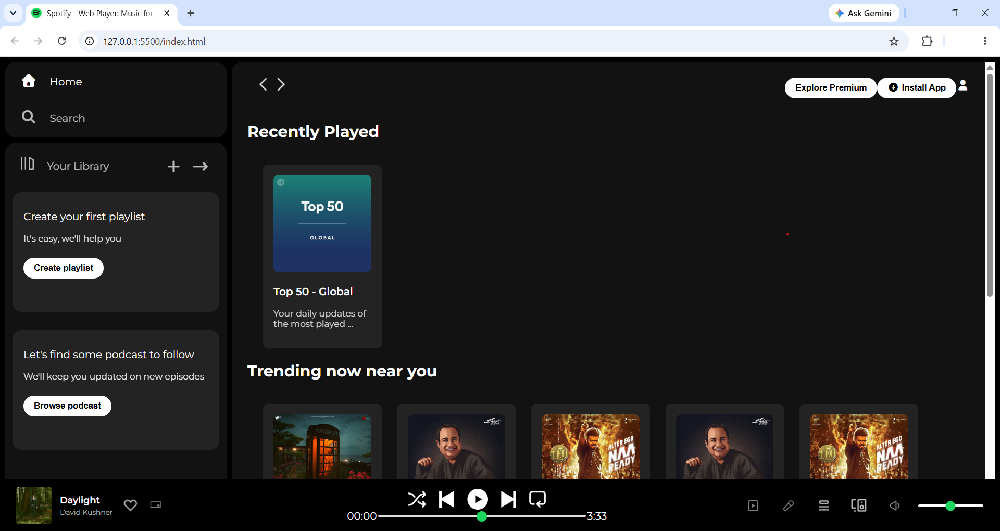
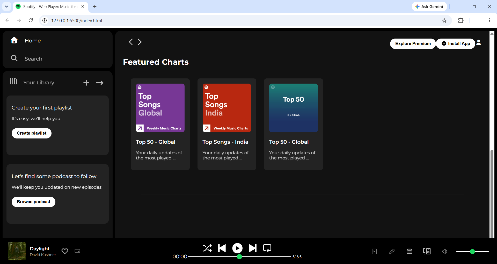

# Spotify UI Clone 🎵

A simple Spotify-inspired music player interface created as my first web development project.

## About the Project

This project is a basic front-end UI inspired by the Spotify music player interface.

I created this project to practice the fundamentals of web development, including HTML structure, CSS styling, layouts, spacing, and responsive design.

## Technologies Used

- HTML5
- CSS3

## Features

- Spotify-inspired music player interface
- Navigation sidebar
- Music playlist section
- Music player controls
- Volume control
- Progress bar
- Clean and simple user interface
- Responsive layout

## Project Preview

### Home Page

### Scrolled View

## Live Demo

[View Live Demo]([YOUR-LIVE-DEMO-LINK](https://purvakale16.github.io/Spotify-UI-Clone/))

## What I Learned

Through this project, I practiced:

- Creating webpages using HTML
- Styling webpages using CSS
- Working with Flexbox
- Creating layouts and positioning elements
- Using images and icons
- Designing a clean user interface
- Creating a basic responsive layout

## Copyright

© 2026 Purva Kale. All Rights Reserved.

This project is created for educational and portfolio purposes.
The source code may be viewed for learning purposes, but copying,
redistributing, or presenting this project as your own work is not
permitted without permission from the author.

## Disclaimer

This project is a Spotify-inspired UI clone created for educational
purposes only. It is not affiliated with or endorsed by Spotify.

## Author

**Purva Kale**

B.Tech IT Student
